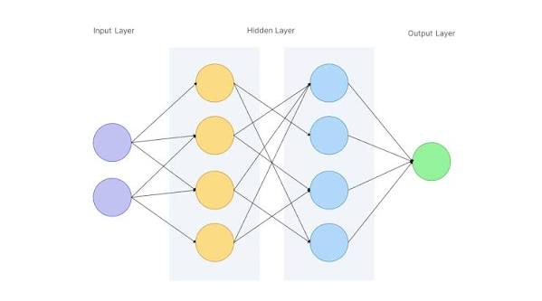

# neural-networks-poc

## Local build (with virtual environment)

### Taskfile

- Install taskfile.dev"
  `curl -1sLf 'https://dl.cloudsmith.io/public/task/task/setup.deb.sh' | sudo -E bash && sudo apt install task`

### Python

Steps to download and install dependencies for local development

- Create a virtual environment:
  `python -m venv .venv`
  or
  `python3 -m venv .venv`

- Activate the virtual environment:
  - Windows users: `source .venv/Scripts/activate`
  - Linux/Mac users: `source .venv/bin/activate`
- Install dependencies:
  `pip install -r requirements.txt`

### Dependencies

- Run task dep:install. Pip will read your pyproject.toml, download NumPy/SciPy, and set up your executable.
- Run task run-eos-polytrope to test it.
- Run task dep:lock to generate the requirements.txt file so you can commit it to Git.

## Authors

- [@rsouza01](https://www.github.com/rsouza01)

## License

[MIT](https://choosealicense.com/licenses/mit/)
